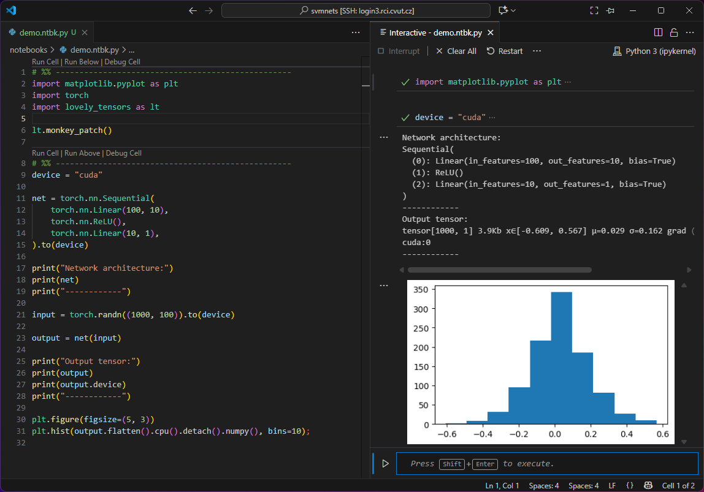

# RCI Interactive Development/Debugging Tutorial




<!-- - Jupyter notebook vs Jupyter interactive cells
- password-less access to RCI
- automatic module loading (direnv)
- virtual environment setup
- running and connecting to a jupyter server -->

The above image demonstrates the result of this tutorial:
- VSCode server is run on RCI login node and allows to edit the code there remotely over SSH
- An interactive window is connected to a Jupyter server on an interactive GPU node, all modules and virtual environments are correctly loaded
- You can run the full code or an individual cell only (repeatedly and in custom order)
- It is possible to explore/edit variables interactively and visualize the results

The following sections describes necessary steps of this setup. Please, complete them all in the given order before you report any problems.

The primary goal here is to connect to RCI, but the tutorial should be easy to adapt to any other SLURM-based cluster and (with simplifications) also to a standard ssh-accessible GPU server.

## Three Ways of Python in VSCode

There are three basic ways of editing and running Python in VSCode:
  1. Writing the code in a Python .py file and running it on the command line (non-interactive)
  2. Using [Jupyter notebooks](https://code.visualstudio.com/docs/datascience/jupyter-notebooks) (.ipynb files).
  3. Using [Jupyter code cells](https://code.visualstudio.com/docs/python/jupyter-support-py) together with an interactive window (.py file with special comments to separate the code cells).

The first option is used for long running or non-interactive jobs which is not the topic of this tutorial.

The advantage of a Jupyter notebook is that both the code and the outputs are stored in one file, which may be useful for submitting the report. It is, however, more difficult to handle by git and without the interactive console, all outputs (even the debug ones) are stored in the same file, so one is constantly creating and deleting cells and variable inspection is cumbersome. 

**In this tutorial we will advocate for the use of the Jupyter code cells.** It allows code separation into functional cells and provides an independent (graphical) console for data manipulation, visualization and code testing. However, the setup will work also for the Jupyter notebooks if you find them useful for your style of work.

**Hint:** In order to distinguish standard `.py` files and the files containing Jupyter code cells, we like to change the file extension to `.ntbk.py`.

## Password-Free Access to RCI

In order to make all the connections smooth, start by setting up a password-free access to the RCI login node. There are many tutorials online for this, so we do not cover it here. As a result you should be able to run
```
ssh username@login3.rci.cvut.cz
```
without being asked for the password.

## Automatic Module Loading

The server allows you to load several versions of [pre-build modules](https://gpu.fel.cvut.cz/wiki/modules) (like Python, PyTorch, cURL, ...) dynamically. Each project needs different modules. This section shows how to load/unload these modules for each project automatically by just entering their project directory. The next section combines it with activating the respective virtual environment.

You will need to install [direnv](https://direnv.net/) utility:
```
ml cURL/8.7.1-GCCcore-13.3.0
mkdir -p ~/.local/bin
curl -sfL https://direnv.net/install.sh | bash
```

and add the following line to your `.bashrc`
```
eval "$(direnv hook bash)"
```
and this line to `.bash_profile`
```
export PATH="$HOME/.local/bin:$PATH"
```

From now on, you can specify commands (e.g. module load) which are run when entering a particular directory using `.envrc` files. For our purpose it is usually enough to load CUDA support modules and to choose a version of Python used by the project.

Note, that all your code has to be in a directory visible from both the RCI login node and the RCI GPU nodes (e.g. `/mnt/personal/username/my_project`).

To find the right CUDA version, allocate an interactive GPU node, check the CUDA version used
```
srun -p fast --gres=gpu:1 --pty bash -i
nvidia-smi   # check the CUDA version (e.g. 12.4)
```

Create a file `.envrc` in the project directory and add the following lines in it (change the versions as needed):
```
ml Python/3.12.3-GCCcore-13.3.0
ml CUDA/12.4.0
```
If you then run `direnv allow` inside the project directory, it automatically loads the respective modules every time you enter this directory and unloads them when you leave it. You will need to run this command every time you change the `.envrc` file.

**Hint:** One may also load a PyTorch module here, but from our experience, it is usually better to install it using pip later on inside the virtual environment for compatibility with other packages.

## Virtual Environment

Every project needs different mixture of Python packages and their versions. It is a good habit to build a virtual environment for each project, so that the updates in one project do not break dependencies in another.

With Python loaded by `direnv`, and still in our project directory run
```
python -m venv ./venv
```
Not that the folder name `./venv` is important for VSCode to recognize it automatically. If you like to store your virtual environments in other place, just make a link to it with this name here.

You want to activate this environment automatically every time you enter your project directory. For that, add this line to the end of the `.envrc` file:
```
source venv/bin/activate
```

and you can check that the environment is activated by
```
python -c "import sys; print(sys.prefix)"
```

Now you can install your favorite packages. They will be local to your virtual environment:
```
pip install matplotlib scipy numpy einops lovely-tensors jupyter
```

You may now run locally your Python scripts and the environment stays stable and controllable.

## Remote Development

We are now ready to start using the setup for remote interactive development.

To allocate an interactive GPU node and to run a Jupyter notebook there, you may use the [lauch_jupyter_slurm.sh](../scripts/launch_jupyter_slurm.sh) script. It also creates an ssh tunnel, so that the Jupyter server is accessible to VSCode running on the RCI login node. The easiest is to run it from the project folder without any parameters.

```
Usage: ./launch_jupyter_slurm.sh [-d work_dir] [-p jupyter_port]

  -d  Directory to launch Jupyter from (default: current dir)
  -p  Port Jupyter listens on on the compute node (default: random in range 8000-9999)

Example:
  ./launch_jupyter_slurm.sh -d /scratch/myproject -p 8889
```
It outputs the URL of the Jupyter server, e.g.
```
==> Access Jupyter at:  http://localhost:8888/?token=5ce9625364ea03ac37977d111c971649d4c1ceb1a3934917
```

Finally, connect VSCode to the running Jupyter server

- Open your local VSCode (at your computer) and connect to a remote server (`login3.rci.cvut.cz`) by pressing F1 and selecting "Remote-SSH: Connect Current Window to Host...".
- Install a direnv extension (the one by Martin Kühl).
- Install the Jupyter extension.
- Open your project directory.
- VSCode should pick the correct interpreter in the `.venv` subdirectory with Python version corresponding to the one installed earlier. Do it manually if the automatic pairing fails.
- Open new `.ntbk.py` file and create a first cell, e.g.
```python
# %% 
import matplotlib.pyplot as plt
```
- Open an interactive window: F1 -> Jupyter: Create Interactive Window
- Click the interpreter button (top right) in the Interactive window.
- Select Another Kernel...
- Existing Jupyter Server...
- Past the URL from the `launch_jupyter_slurm.sh` script
- Run the cell by Shift-Enter or click Run Cell button

**Well done! :)**
